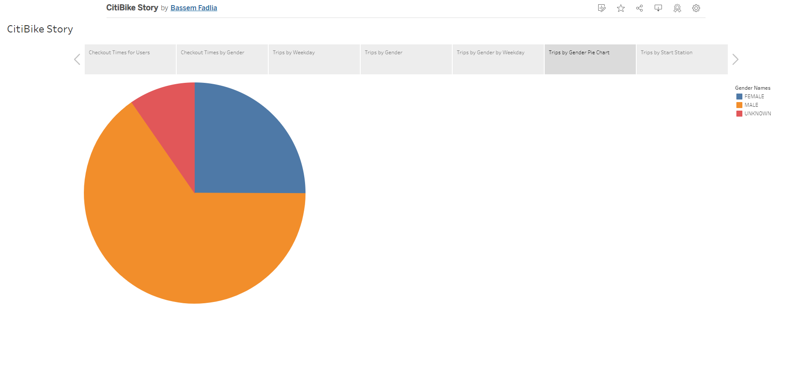
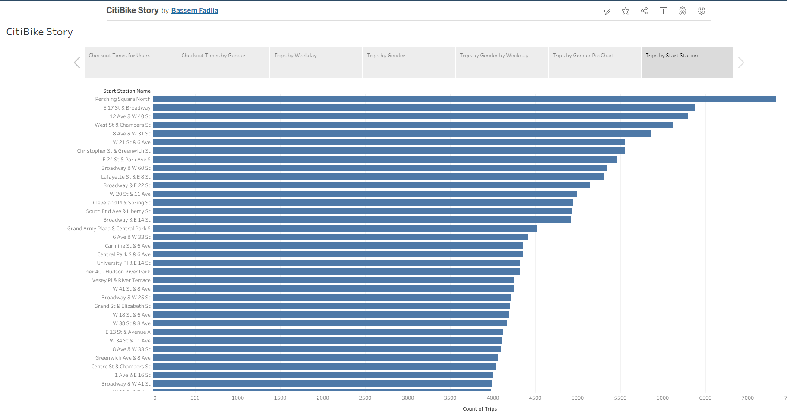
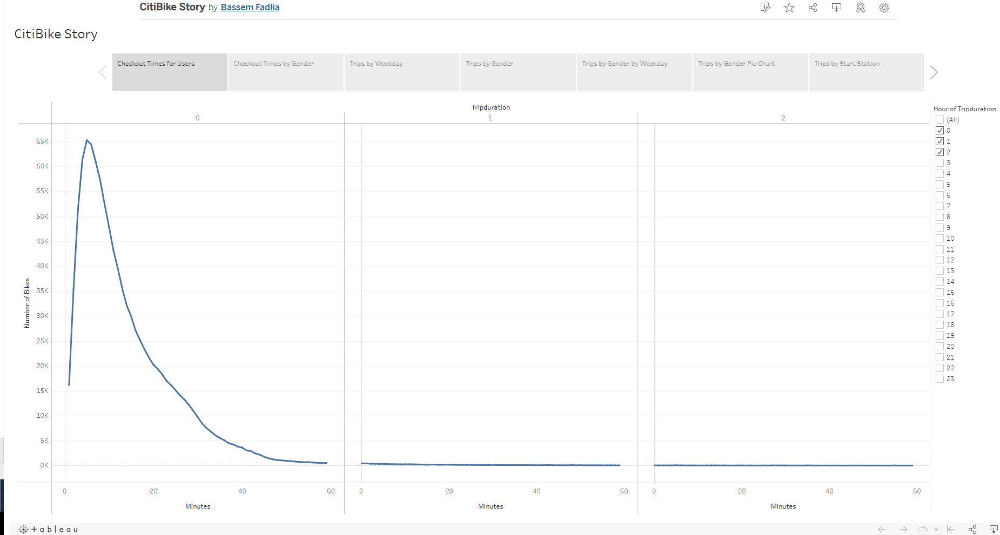
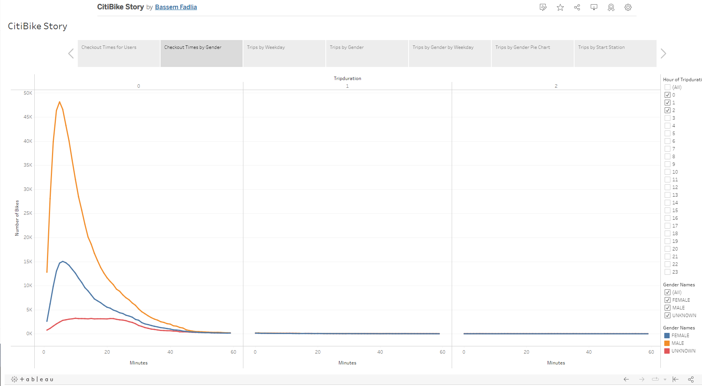
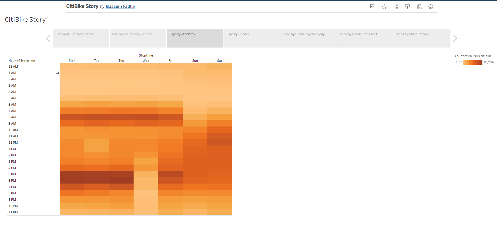
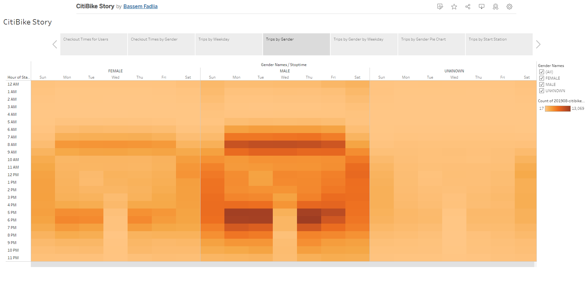
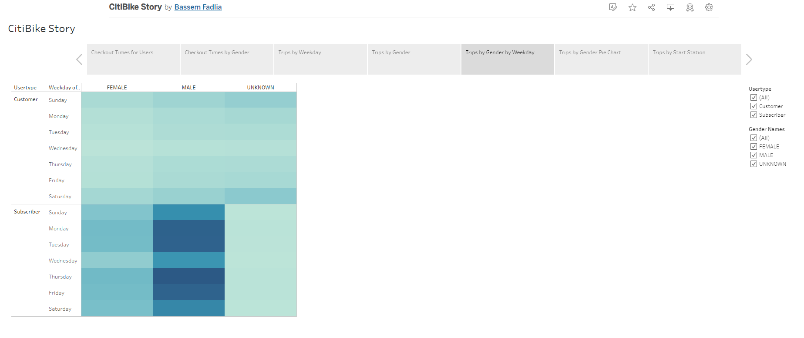

# Bikesharing with NYC CitiBike data
An analysis of NYC CitiBike bikesharing using Tableau

## Overview
The Tableau story with all the visualizations our team developed can be seen here  [at this link](https://public.tableau.com/app/profile/bassem.fadlia/viz/CitiBikeStory_16568733733900/CitiBikeStory).

The project is intended to analyze bikeshare data from CitiBike in New York City to present to investors looking to begin a bikeshare program in Des Moines, Iowa. The analysis tries to answer a few key questions:
- Who uses bikeshare programs?
- What time of day are the bikes used most and the least?
- How much are the bikes used and by whom?
- What are the locations where rides start from the most?

## Results
Taking into account the different demographics of Des Moines compared to NYC, analyzing the NYC data we have can provide the following insight .
***

Male users of the program are more than twice the female users. So the company may initially focus on male customers while starting the program but then look for ways to attract female customers to create new market expansion.
***

The graph above shows the trip origination station sorted descendingly. This can help the company plan the logidstics so that bikes are quickly moved to the stations that have high demand while those with less demand can be placed at a lower priiority or even further analysis can determine if some of the low demand stations should be eliminated. 

***

A heatmap helps show weekly usage patterns. Heavy usage usage is as expected happening most during weekday commute times, while weekend usage is spread throughout the middle of the day. Also, we can see low-usage early in the morning every day of the week.
***

This graph of number of trips by duration show that the most trips are under an hour in length. The peak of the graph is in the 10-15 minutes range. So the company needs to plan for moving bikes around between relatively short trips which would be very different than planning if customers kept their bikes for several hours each time.
***

This graph shows that most trips happen at peak work commute times which are Monday through Friday around 8AM and 5PM. The company should avoid any maintenance or other down time during those hours..
***

This graph shows again that the majority of customers are male and that trip duration is typically very short within 10-15 minutes range and very rarely lasting more than an hour.
***

This heatmap shows again that the userbase is dominated by male, subscribing users. Perhaps females are worried about safety and harrasment in a city like NYC while Des Moines can be more even as it is much safer.

## Summary
We learned in this project and can show the potential investors that bikeshare services are remarkably popular in busy metropolitan areas, where real estate is densely packed, car traffic is a headache and parking spaces are scarce. The user base is made up mostly of male subscribers, providing regular income to the program. More outreach should be done to attract female riders. Main usage hours coincide with morning and evening commute times. The program revenew comes mostly from users using the bikes to commute to work rather than pleasure. So perhaps the bike brand(s) offered should not be focused on the sporty and leisurly features.

Other aspects to analyze in the future:
- Analyze traffic patterns of the bikes. What direction is the bike traffic going in the morning as opposed to the evening of weekdays.
- Analyzing the relation between age and ridership

